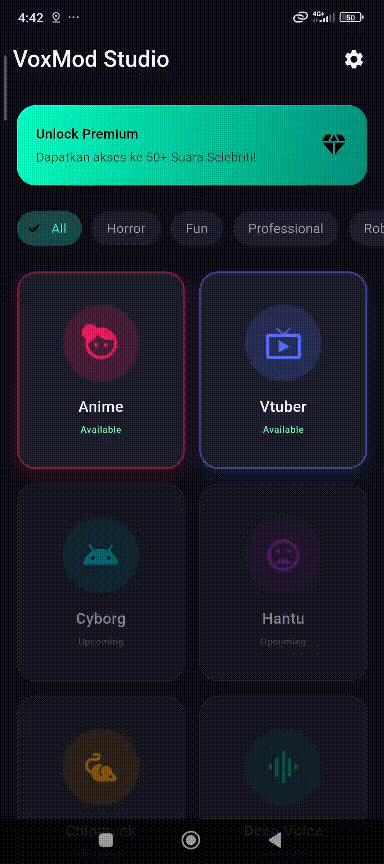

# 🎙️ VoxMod: AI Voice Studio

> **Transform your voice into anyone.** VoxMod is a next-generation AI Voice Changer application powered by **RVC (Retrieval-based Voice Conversion)**. It seamlessly integrates a Flutter-based mobile studio with a high-performance Python FastAPI backend to deliver realistic, customizable voice transformations.

**⚠️ Note:** This application is currently in **active development**. Features may change, and some functionalities might be unstable. Use at your own discretion.

---

## ✨ Features

### 📱 Frontend (Flutter)
- **Studio Mode**: Professional recording interface with real-time audio visualizer.
- **Dynamic Pitch Control**: Adjust voice pitch seamlessly (-12 to +12 semitones).
- **Regenerate Logic**: Record once, edit pitch indefinitely without re-recording.
- **Smart Result Player**: Playback original vs. converted audio with speed control.
- **Interactive UI**: Modern dark-themed UI with animated waves and intuitive sliders.

### ⚙️ Backend (Python AI)
- **RVC Engine**: Powered by `rvc-python` with `rmvpe` (Harvest) extraction for high fidelity.
- **FastAPI Server**: Lightweight, asynchronous REST API handling voice conversion requests.
- **Auto-Flattening**: Automatically fixes audio format issues (channels/sample rate) before processing.
- **Dynamic Model Loading**: Supports hot-swapping between multiple voice models (e.g., Keqing, Klee).
- **GPU Acceleration**: Optimized for NVIDIA CUDA execution (supports CPU fallback).

---

## 📸 Workflow Preview

1. **Select Character**: Choose from available presets (Anime, Cyborg, etc.).
2. **Studio Record**: Record your voice. The app sends raw audio with default pitch (+12 for anime).
3. **Result & Edit**: Listen to the result.
    - *Too deep?* Slide pitch up.
    - *Too squeaky?* Slide pitch down.
    - Click **"Apply"** to regenerate audio on the server instantly.

---

## 🎭 Voice Presets (Models)

VoxMod is designed to work with standard `.pth` (RVC Model) and `.index` (Feature Retrieval) files.

| Preset Name     | Icon | Pitch Strategy | Description |
|-----------------|------|----------------|-------------|
| **Anime Girl**  | 👧   | +12 Semitones  | High-pitch, cute tone (Target: Keqing/Genshin). |
| **Loli / Kid**  | 🎒   | +12 to +16     | Child-like, energetic voice (Target: Klee). |
| **News Anchor** | 🎙️   | 0 (Normal)     | Deep, formal, and authoritative. |
| **Deep / Villain** | 🔉 | -12 Semitones | Heavy bass, dark, mysterious tone. |
| **Chipmunk**    | 🐿️   | +20 Semitones  | Extreme high-pitch, fast and playful. |

---

## 📂 Project Structure

voxmod-voice-studio/  
├── README.md               # Dokumentasi umum proyek (cara install, cara jalanin)  
├── LICENSE                 # Lisensi kode (misal: AGPL-3.0)  
├── .gitignore              # File/folder yang diabaikan Git  
├── SECURITY.md             # Kebijakan keamanan proyek  
│  
├── api-contract/           # Dokumentasi spesifikasi API  
│   └── openapi.yaml        # File kontrak API (Backend ↔ Frontend)  
│  
├── backend/                # Server Python & Engine AI (RVC)  
│   ├── assets/             # Model AI & file index  
│   │   ├── hubert/         # Model pre-trained untuk ekstraksi fitur suara (soft-vc hubert)  
│   │   └── weights/        # Model suara karakter (.pth) & index (.index)  
│   ├── outputs/            # Hasil konversi audio sementara  
│   ├── uploads/            # File rekaman mentah dari user  
│   ├── main.py             # Kode utama server FastAPI & AI inference  
│   ├── note.txt            # Catatan: file model yang diperlukan & link download  
│   ├── requirement.txt     # Dependencies utama  
│   └── requirement(first).txt # Dependencies tambahan / alternatif  
│  
└── frontend/  
    ├── README.md           # Dokumentasi bagian mobile apps  
    └── voxmod_voice_studio/ # Root project Flutter  
        ├── android/        # Konfigurasi native Android (Gradle, Manifest, permission mic)  
        ├── ios/            # Konfigurasi native iOS (Info.plist, Runner)  
        ├── lib/            # Source code utama (Dart)  
        │   ├── screens/    # Halaman UI  
        │   │   ├── home_screen.dart  
        │   │   ├── studio_screen.dart  
        │   │   └── result_screen.dart  
        │   ├── services/   # Logika komunikasi data  
        │   │   └── api_services.dart  
        │   └── main.dart   # Entry point aplikasi  
        ├── assets/         # Aset statis (gambar, icon, font)  
        └── pubspec.yaml    # Manajer paket/library Flutter & aset  

---

## 🛠️ Installation & Setup

### Backend Setup
Prerequisites: Python 3.10+, FFmpeg installed and added to PATH, NVIDIA GPU with CUDA recommended.  
Install Python dependencies: torch, torchvision, torchaudio, fastapi, uvicorn, python-multipart, rvc-python.  
Place `hubert_base.pt` and `rmvpe.pth` in the backend root.  
Place voice models (e.g., Keqing.pth, Keqing.index) in `backend/assets/weights/`.  
Run the server. It will start at `http://0.0.0.0:8000`.

### Frontend Setup
Prerequisites: Flutter SDK, Android Emulator or Physical Device.  
Get dependencies. Configure `lib/services/api_service.dart` with your PC’s local IP (`baseUrl`).  
Run the Flutter app.

---

## 📡 API Reference

**POST /convert**  

Parameters:  
- `file`: File, raw audio recording (.aac, .wav)  
- `character`: String, character name for logging  
- `model_name`: String, model filename (e.g., Keqing.pth)  
- `index_name`: String, index filename (e.g., Keqing.index)  
- `pitch`: Int, pitch shift value (e.g., 12, 0, -12)  

Response: Returns processed `.wav` audio file.

---

## 🐛 Troubleshooting

- FFmpeg not found → ensure installed and in PATH.  
- Connection refused → make sure phone and PC are on same Wi-Fi and API URL uses PC IP, not localhost.  
- Audio robotic/glitchy → adjust pitch (-12 to +12), ensure clear recording without background noise.

---

## 📝 Backend Notes

**note.txt**:  
- Required assets:  
  - Keqing.index  
  - Keqing_e500_s13000.pth  
  - hubert_base.pt  
  - rmvpe.pth
  - zeta
  - Klee  
  - Others or download from:  
    - [Google Drive](https://drive.google.com/drive/folders/1cGXv43h6hgYSjyCiJ1LKe9FEdCe0BhLB?usp=drive_link)  
    - [Huggingface KleeJP](https://huggingface.co/Kakao111/KleeJP/resolve/main/KleeJP.zip?download=true)  

**Additional Requirements / Installation Notes**:  
- pip install "numpy<2.0"  
- pip install rvc-python  
- pip uninstall -y numpy tensorflow tensorboard tf-keras tb-nightly  
- pip install "numpy==1.26.4"  
- pip install "tensorboard==2.15.1"  
- pip install scipy  
- pip install fastapi uvicorn rvc-python pydub python-multipart  
- pip install librosa  
- FFmpeg: download [here](https://www.gyan.dev/ffmpeg/builds/) & check with `ffmpeg -version`

**requirement.txt**: fastapi, uvicorn, python-multipart, requests, numpy, scipy, torch, torchaudio, librosa==0.9.2, soundfile, fairseq, faiss-cpu  
**requirement(first).txt**: fastapi, uvicorn, python-multipart, requests, numpy, scipy

---

## 🔒 License

MIT License:  
✅ Personal use, educational use, modification, and commercial use allowed.  
✅ Redistribution and private use allowed.  

**Disclaimer:** For creative and educational purposes only. Do not use for deepfakes or malicious impersonation.

Built with 💙 by <b>VoxMod Team</b>

Built with 💙 by <b>VoxMod Team</b>

